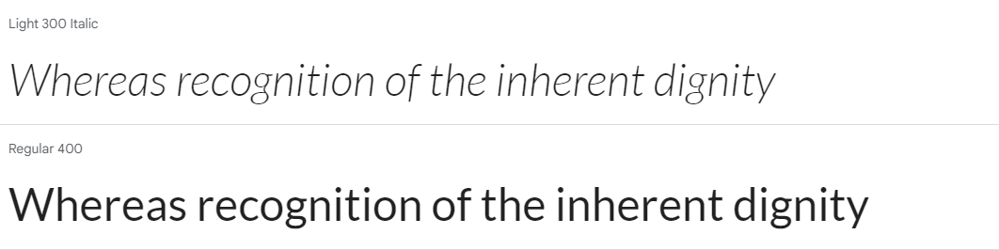

# DentalDecor

## Table of Contents

1. [Overview](#overview)
2. [Project Goals](#project-goals)
    1. [User Goals](#user-goals)
3. [Business Model](#business-model)
    1. [SEO](#seo)
    2. [Target Audience](#target-audience)
4. [User Experience](#user-experience)
    1. [User Requirements and Expectations](#user-requirements-and-expectations)
    2. [User Stories](#user-stories)
    3. [Site Owner Stories](#site-owner-stories)
5. [Design](#design)
    1. [Colours](#colours)
    2. [Fonts](#fonts)
    3. [Database](#database)
    4. [Data Models](#data-models)
    5. [Wireframes](#wireframes)
    6. [Agile Design](#agile-design)
6. [Technologies Used](#technologies-used)
    1. [Languages & Frameworks](#languages--frameworks)
    2. [Libraries and Tools](#libraries--tools)
7. [Features](#features)
8. [Future Features](#future-features)

9. [Deployment](#deployment)

10. [Credits](#credits)
    1. [Code](#code)
    2. [Tutorials](#tutorials)
    3. [Imagery](#imagery)
11. [Acknowledgements](#acknowledgements)

## Overview

Dental Decor is an e-commerce platform built on the Django framework, specializing in the sale of exquisite dental art and curated gifts tailored for dental professionals and businesses. Our product range is thoughtfully categorized into custom, collectibles, educational, and wall art segments, offering a diverse selection to meet the distinct preferences of our discerning clientele.The website is meticulously designed to offer an intuitive and seamless user experience. Navigating through our carefully curated categories is effortless, ensuring customers find the information they seek with ease.
A search feature empowers customers to quickly locate specific items of interest, enhancing the efficiency of their shopping experience.Customers can explore products, submit queries, and view detailed product information without the need for website registration. However, features such as wishlists and reviews are exclusively available to registered users.
Upon registration, user information is securely stored, providing a personalized experience. Each registered user gains access to a dedicated profile page, streamlining future interactions.As the website is created for my fifth Portfolio project for code institute and  is therefore intended for demonstration purposes, users can test the purchasing functionality using the following card details:

**Card Number**: 4242424242424242|
**Expiration Date**: Any future MM/YY|
**CVN**: Any 3-digit number|
**Postcode**: Any 5-digit numeral

It's important to note that the payment system is designed exclusively for testing, and actual debit or credit cards will not result in successful transactions. No charges will be incurred on users' cards during this testing phase.

Dental Decor aims to provide not only a seamless shopping experience but also a platform where dental art enthusiasts can explore and appreciate the craftsmanship of our curated collection. 

## Site owner Goals

* To allow customers on website to have options to purchase products with ease.
* To ensure users have a great UX and UI when visiting the website.
* To showcase features for registered and unregistered customers.
* To give users visiting the website the option to regsiter an account.
* To ensure customers can leave a product review.
* To allow registered customers to add product to a wishlist for future purchases. 
* To ensure sufficient website traffic is generated with Search engine optimization and social media marketting.

### User Goals

* Users should understand the website purpose on homepage with ease. 
* Users should achieve intuitive navigation. 
* Users are able to filter and sort products. 
* Users can search for specific products. 
* Users can view details for each product shown on website. 
* Users can edit their profile and reviews made by them. 
* Users can see other user's reviews 
* Users are able to successfully purchase a product with ease. 
* Users can add items to wishlist if they wish purchase at a later stage. 
* Users can contact site staff by sending a query via the contact us form. 
* Users can sign up for newspaper subscriptions.
* Users can visit social media pages of the business. 

## Business Model

I have developed an e-commerce Django website that sells dental art that involves the following factors:

1. Product:Dental Decor products are categorized into wall art, collectables , educational and custom pieces, created to attract dental professionals or businesses.
2. Target:Any individuals in a dental community or someone who'd want to gift a dental professional.
3. Features:Dental decor customers should be able to browse, select and purchase products, add products to wishlist, see and add reviews, sign up for newspaper susbscription and would be able to make contact with the business by sending a query via contact form.
5. Marketing and Branding:This implemented through social media such as facebook, instagram
6. Customer Engagement:
Business is able to engage with customers through newsletters, contact form or via social media.

### SEO

### Marketing

* Facebook page- A facebook page was made for the website 

### Target audience

##### Back to [top](#table-of-contents)
## User Experience

### User Requirements and Expectations

### User stories

### Site Owner Stories

## Design

Design of website was thoughtout through color scheme, typography and imagery.It was carried out through the entirety of the website.

### ColorScheme

The following color palette was chosen initially .

During development of the website #FFA70A was left out at the end because of contrast errors. The website colors was kept more simple with the main color being a darker version of #008080. 
The final colors of the website is shown as following: 

Main colors: #003333 and #006666
Background: #F5F5F5
Text colors: #333333 & #FFFFF0

### Typography 

For Dental Decor:
"Lato" font was used
This font family was used because of its modern and professional feel. It is often used for website because of its Versatility in width and style. 

### Imagery

All the product images and carousal images were sourced from [Etsy](https://www.etsy.com/ie/market/dentist_clinic_decor?ref=return_to_search). My Code institute facilitator had mentioned to us that sourcing images from amazon or etsy were perfectly okay as long as this was credited in Readme. All other images were sourced from free image sources such as pexels. Please see [Acknowledgment Secion](#acknowledgements) below.

##### Back to [top](#table-of-contents)

## Database
***

### Data Models

#### User model

####  Product

####  Category

####  CustomerProfile

#### Contact

#### Order

####  OrderLineItem

### Wireframes

Big screens - laptop & desktop

Home page

Shop

 details

Shopping cart

Profile

Contact us page

Authentication pages

checkout pages

Wishlist

checkoutpage

***

Medium screens

Home page

Shop

 details

Shopping cart

Profile

Contact us page

Authentication pages

Wishlist

checkoutpage

***

Small screens

Home page

Shop

 details

Shopping cart

Profile

Contact us page

Authentication pages

Wishlist

checkoutpage

***

##### Back to [top](#table-of-contents)

## Agile Design

## Technologies Used

### Languages & Frameworks

* HTML5
* CSS3
* Javascript
* Python 3.10
* Django 3.2

### Libraries & Tools

* [Bootstrap5](https://getbootstrap.com/docs/5.0/getting-started/introduction/)- Used for front end development.
* [Bootstrap icons](https://icons.getbootstrap.com/)- Used for all the icons used in the website.
* [ElephantSQL](https://www.elephantsql.com/)-  Manages PostgreSQL databases.
* [GitHub](https://github.com/)- Used to store and manage repository.
* [Git](https://git-scm.com/)- Used for version control
* [Balsamiq](https://balsamiq.com/)- Used to develop wireframes for project 
* [SVG grepo](https://www.svgrepo.com/svg/284261/tooth)- To make svg icons
* [Birme](https://www.birme.net/)- Used to format images
* [Real Favicon Generator](https://realfavicongenerator.net/)- Generator for favicon
* [Am i responsive](https://ui.dev/amiresponsive)- Used to see website in different devices at once.
* [Pexels](https://www.pexels.com/)- Free image source.
* [AWS](https://aws.amazon.com/)- Used to host images.
* [Heroku](https://www.heroku.com/)- For deployment.
* [Stripe](https://stripe.com/ie)- Used for payment for purchases.
* [Google fonts](https://fonts.google.com/)- Used to select font used in website.
* [Diagram net](https://www.diagrams.net/)- Used to draw out Entity diagram.

## Features

## Future features

##### Back to [top](#table-of-contents)

## Testing

## Bugs

## Deployment

## Credits

### Code

### Tutorials

### Imagery

## Acknowledgements

