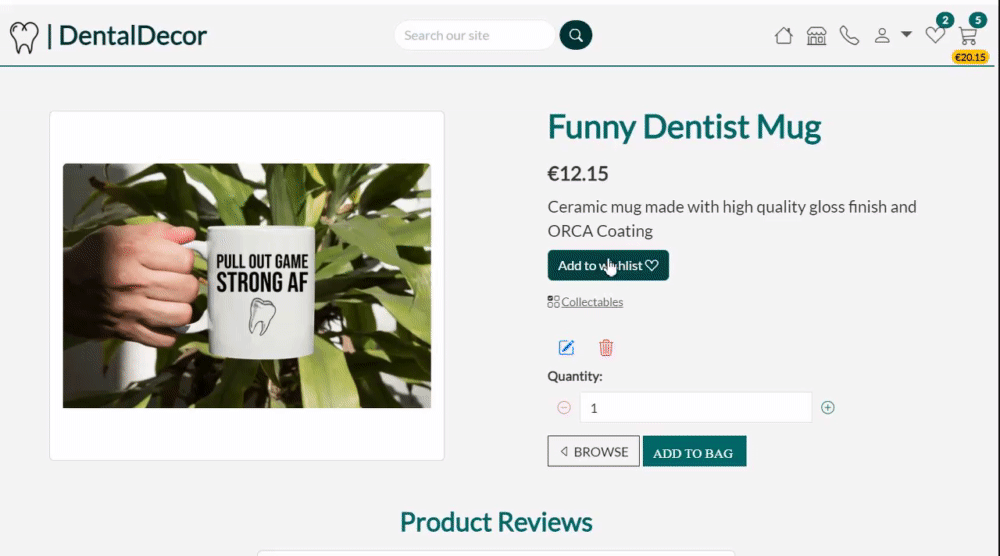
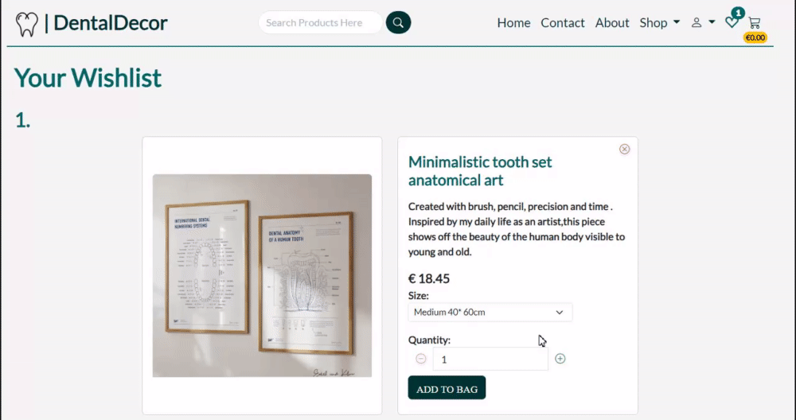
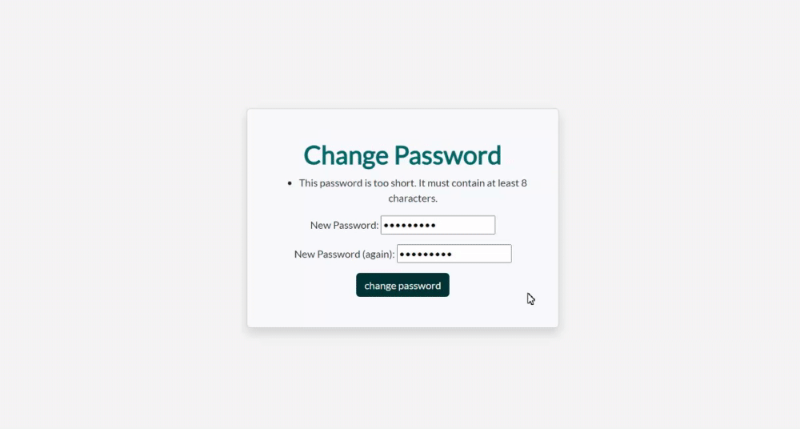
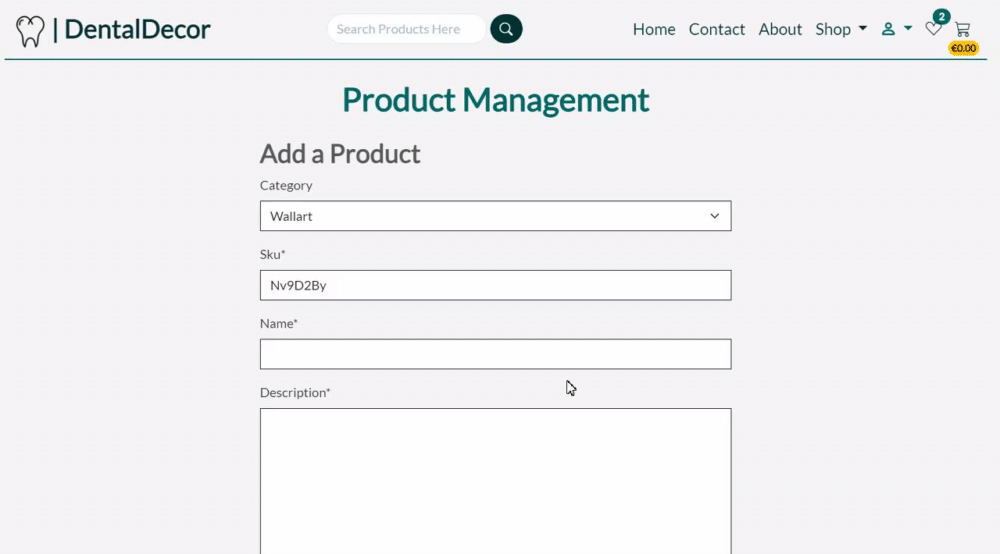
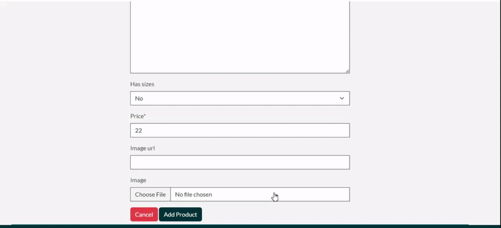

# DentalDecor


## Table of Contents

1. [Overview](#overview)
2. [Project Goals](#project-goals)
    1. [User Goals](#user-goals)
3. [Business Model](#business-model)
    1. [SEO](#seo)
    2. [Target Audience](#target-audience)
4. [User Experience](#user-experience)
    1. [User Requirements and Expectations](#user-requirements-and-expectations)
    2. [User Stories](#user-stories)
    3. [Site Owner Stories](#site-owner-stories)
5. [Design](#design)
    1. [Colours](#colours)
    2. [Fonts](#fonts)
    3. [Database](#database)
    4. [Data Models](#data-models)
    5. [Wireframes](#wireframes)
    6. [Agile Design](#agile-design)
6. [Technologies Used](#technologies-used)
    1. [Languages & Frameworks](#languages--frameworks)
    2. [Libraries and Tools](#libraries--tools)
7. [Features](#features)
8. [Future Features](#future-features)
9. [Testing](#testing)
10. [Bugs](#bugs)
11. [Deployment](#deployment)

12. [Credits](#credits)
    1. [Code](#code)
    2. [Tutorials](#tutorials)
    3. [Imagery](#imagery)
13. [Acknowledgements](#acknowledgements)

## Overview

Dental Decor is an e-commerce platform built on the Django framework, specializing in the sale of exquisite dental art and curated gifts tailored for dental professionals and businesses. Our product range is thoughtfully categorized into Apparels, Collectibles, Educational, and Wall art segments, offering a diverse selection to meet the distinct preferences of our discerning clientele.The website is meticulously designed to offer an intuitive and seamless user experience. Navigating through our carefully curated categories is effortless, ensuring customers find the information they seek with ease.
A search feature empowers customers to quickly locate specific items of interest, enhancing the efficiency of their shopping experience.Customers can explore products, submit queries, and view detailed product information without the need for website registration. However, features such as wishlists and adding reviews are exclusively available to registered users.
Upon registration, user information is securely stored, providing a personalized experience. Each registered user gains access to a dedicated profile page, streamlining future interactions.As the website is created for my fifth Portfolio project for code institute and  is therefore intended for demonstration purposes, users can test the purchasing functionality using the following card details:

**Card Number**: 4242424242424242|
**Expiration Date**: Any future MM/YY|
**CVN**: Any 3-digit number|
**Postcode**: Any 5-digit numeral

It's important to note that the payment system is designed exclusively for testing, and actual debit or credit cards will not result in successful transactions. No charges will be incurred on users' cards during this testing phase.

Dental Decor aims to provide not only a seamless shopping experience but also a platform where dental art enthusiasts can explore and appreciate the craftsmanship of our curated collection. 

## Site owner Goals

* To allow customers on website to have options to purchase products with ease.
* To ensure users have a great UX and UI when visiting the website.
* To showcase features for registered and unregistered customers.
* To give users visiting the website the option to regsiter an account.
* To ensure customers can leave a product review.
* To ensure customers can see other customers reviews.
* To allow registered customers to add product to a wishlist for future purchases. 
* To ensure sufficient website traffic is generated with Search engine optimization and social media marketting.

### User Goals

* Users should understand the website purpose on homepage with ease. 
* Users should achieve intuitive navigation. 
* Users are able to filter and sort products. 
* Users can search for specific products. 
* Users can view details for each product shown on website. 
* Users can edit their profile and reviews made by them. 
* Users can see other user's reviews 
* Users are able to successfully purchase a product with ease. 
* Users can add items to wishlist if they wish purchase at a later stage. 
* Users can contact site staff by sending a query via the contact us form. 
* Users can sign up for newspaper subscriptions.
* Users can visit social media pages of the business. 

## Business Model

I have developed an e-commerce Django website that sells dental art that involves the following factors:

1. Product:Dental Decor products are categorized into wall art, collectables , educational and apparel pieces, created to attract dental professionals or businesses.
2. Target:Any individuals in a dental community or someone who'd want to gift a dental professional.
3. Features:Dental decor customers should be able to browse, select and purchase products, add products to wishlist, see and add reviews, sign up for newspaper susbscription and would be able to make contact with the business by sending a query via contact form.
5. Marketing and Branding:This implemented through social media such as facebook, instagram
6. Customer Engagement:
Business is able to engage with customers through newsletters, contact form or via social media.


### SEO

 I executed a  SEO plan to enhance the online presence of the dental decor websitet. The initial phase involved e keyword research to pinpoint relevant long and short-tail keywords associated with my products. I optimized title tags, meta descriptions, and URLs by incorporating these keywords, thereby boosting the web-shop's visibility in search engine results.I created high-quality content that seamlessly integrated the identified keywords. To optimize images, I employed descriptive file names and alt tags, contributing to an overall improvement in search engine rankings. The ultimate goal was to attract potential customers actively searching for products within the same category, thus increasing the visibility and reach of the website. sitemap was generated using xml-sitemaps and is included in the root level of the project.Robots.txt file was created and tells the search engine crawlers which URLs they can access on the website.
    


### Marketing

* Facebook page- A facebook page was made for the website 


### Target audience

- Dental professionls who are looking for art for their business or clinic.
- Dental professionals or friends/ family of dental professionals looking for a unique piece of dental art to gift another fellow dental professional.


##### Back to [top](#table-of-contents)
## User Experience

### User Requirements and Expectations

* Customers are able to navigate through the website intuitively.
* Customers are able to read descriptions for each product.
* Customers can search for specific products.
* Customers are able sort and filter products.
* Customers are able to checkout seamlessly.
* Seamless authentication system.
* Customers can review products.
* Customers are able to add products to their wishlist before adding them to the shopping bag.
* Customers are able to experience a responsive website.

### User stories

* [#1](https://github.com/SooryaGeorge7/Dental_Decor/issues/2) As an unregistered user i would like to be able to view the website homepage so that i can have an overview of the site.
* [#2](https://github.com/SooryaGeorge7/Dental_Decor/issues/3)As a unregistered customer i want to navigate website easily so that i can find what i am looking for without difficulty
* [#3](https://github.com/SooryaGeorge7/Dental_Decor/issues/4)As a User i can register for website so that i can login so that my data is already saved from registering
* [#4](https://github.com/SooryaGeorge7/Dental_Decor/issues/5)As a User i can access the footer of the website so that i can visit the site's social media pages
* [#5](https://github.com/SooryaGeorge7/Dental_Decor/issues/6)As an unregistered customer i can see all the products available on the website so that i can decide if the website has a product i want to purchase
* [#6](https://github.com/SooryaGeorge7/Dental_Decor/issues/7)As an unregistered customer i can see details of each product in shop so that i can make more of an informed decision to see whether i want to purchase a particular product
* [#7](https://github.com/SooryaGeorge7/Dental_Decor/issues/8)As a customer i can sort or filter products so that i only see the products i want to see.
* [#8](https://github.com/SooryaGeorge7/Dental_Decor/issues/9)As a unauthenticated user/customer i can have functionality to select the product and add it to my shopping baske so that i can make more of an informed decision to see whether i want to purchase a particular product
* [#9](https://github.com/SooryaGeorge7/Dental_Decor/issues/10)As a unauthenticated user/customer i can select multiple products and add them to my shopping basket so that add all desired products to the cart at once to save time
* [#10](https://github.com/SooryaGeorge7/Dental_Decor/issues/11)As a *unauthenticated user/customer i can increase or decrease the quantity of products in my shopping basket  so that so I have the freedom to change my mind if i want to
* [#11](https://github.com/SooryaGeorge7/Dental_Decor/issues/15)As a unregistered user i can checkout so that i can purchase items without signing up
* [#12](https://github.com/SooryaGeorge7/Dental_Decor/issues/16)As a registered user i can save my details so that future purchases will be less time consuming
* [#13](https://github.com/SooryaGeorge7/Dental_Decor/issues/17)As an unauthenticated user/customer i can sign up so that i can register for an account
* [#14](https://github.com/SooryaGeorge7/Dental_Decor/issues/18)As a user i can put in my card details so that i can buy items with credit/debit cards
* [#15](https://github.com/SooryaGeorge7/Dental_Decor/issues/19)As a authenticated user/customer i can add my details to a secure checkout form so that i can see all the purchases i have made
* [#16](https://github.com/SooryaGeorge7/Dental_Decor/issues/20)As a customer i can put in my card details so that i can make a purchase
* [#17](https://github.com/SooryaGeorge7/Dental_Decor/issues/22)As a Registered User i can add reviews so that i can give feedback to the owners of the products
* [#18](https://github.com/SooryaGeorge7/Dental_Decor/issues/23)As a Registered User i can edit reviews so that i can give change my reviews incase i made a mistake
* [#19](https://github.com/SooryaGeorge7/Dental_Decor/issues/24)As a Registered User i can Delete reviews so that i can remove a review if i changed my mind
* [#20](https://github.com/SooryaGeorge7/Dental_Decor/issues/25)As a User i can add to wishlist so that i can have a list of products that i want to buy in the future
* [#21](https://github.com/SooryaGeorge7/Dental_Decor/issues/26)As a User i can remove from wishlist so that i can change the list of products that i want to buy in the future
* [#22](https://github.com/SooryaGeorge7/Dental_Decor/issues/27)As a User i can Send a Contact us Query so that i can have the necessary information i require regarding the products or the website information
* [#23](https://github.com/SooryaGeorge7/Dental_Decor/issues/28)As a User i can see all product reviews so that i can decide if i want to buy a product with more information
* [#24](https://github.com/SooryaGeorge7/Dental_Decor/issues/29)As a User i can have email confirmation so that i can make sure that the products i bought are really ordered or not


### Site Owner Stories

* [#25](https://github.com/SooryaGeorge7/Dental_Decor/issues/1)As a site developer, I want to Setup, Install Django and libraries

* [#26](https://github.com/SooryaGeorge7/Dental_Decor/issues/21)As a site owner,  I want to provide secure payment options for customers  so that payment process is safe and secure and customers card details are remained private 

* [#27](https://github.com/SooryaGeorge7/Dental_Decor/issues/12)As a site developer i can add new products to the shop so that there are more products in the store
* [#28](https://github.com/SooryaGeorge7/Dental_Decor/issues/13)As a site owner i can delete existing products from the shop so that users are not shown items that are no longer available
* [#29](https://github.com/SooryaGeorge7/Dental_Decor/issues/14)As a Site dev i can edit product information so that the website and product information is updated and relevant

## Design

Design of website was thoughtout through color scheme, typography and imagery.It was carried out through the entirety of the website.

### ColorScheme

The following color palette was chosen initially .

During development of the website #FFA70A was left out at the end because of contrast errors. The website colors was kept more simple with the main color being a darker version of #008080. 
The final colors of the website is shown as following: 

Main colors: #003333 and #006666
Background: #F5F5F5
Text colors: #333333 & #FFFFF0


### Typography 

For Dental Decor:
"Lato" font was used
This font family was used because of its modern and professional feel. It is often used for website because of its Versatility in width and style. 


### Imagery

All the product images and carousal images were sourced from [Etsy](https://www.etsy.com/ie/market/dentist_clinic_decor?ref=return_to_search). My Code institute facilitator(Chris Quinn) had mentioned to us that sourcing images from amazon or etsy were perfectly okay as long as this was credited in Readme. All other images were sourced from free image sources such as pexels. Please see [Acknowledgment Secion](#acknowledgements) below.

##### Back to [top](#table-of-contents)

## Database


<details><summary>(ERD)Physical database model</summary>

</details>

### Data Models

#### User model

- User model as part of the Django allauth library contains  following fields:
username, password,email


####  Product

- Product model made to represent dental decor product containing all relevant fields giving user information they need to make a  purchase

| Name          | Database Key  | Field Type    | Validation |
| ------------- | ------------- | ------------- | ---------- |
|category       | category      | ForeignKey| 'Category', null=True, blank=True, on_delete=models.SET_NULL|
|sku    | sku   | SlugField| default=unique_sku,unique=True|
|name   | name   | CharField| max_length=254 |
|description     | description    | TextField|  |
|has_sizes     | has_sizes | BooleanField| default=False, null=True, blank=True |
| price      |  price     | DecimalField| max_digits=6, decimal_places=2|
|image_url      | image_url   | URLField|  max_length=1024, null=True, blank=True|
|image      | image   | ImageField| null=True, blank=True|


####  Category

- Model made to clearly categorise/divide products in shop

| Name          | Database Key  | Field Type    | Validation |
| ------------- | ------------- | ------------- | ---------- |
|name      | name   | CharField|  max_length=254|
|notes       |notes     | TextField|  |
|friendly_name      | friendly_name    | CharField|  max_length=254, null=True, blank=True|


####  UserProfile

- Model representing an account of a registered user containing
following fields:

| Name          | Database Key  | Field Type    | Validation |
| ------------- | ------------- | ------------- | ---------- |
|user       | user     | OneToOneField|  User, on_delete=models.CASCADE|
|default_phone_number      | default_phone_number     | CharField|  max_length=20, null=True, blank=True|
|default_street_address1       | default_street_address1     | CharField| max_length=80, null=True, blank=True|
|default_street_address2       | default_street_address2     | CharField| max_length=80, null=True, blank=True|
|default_town_or_city       | default_town_or_city     | CharField| max_length=40, null=True, blank=True|
|default_county       | default_county     | CharField| max_length=80, null=True, blank=True|
|default_country       |default_country    | CountryField|  blank_label='Country *', null=True, blank=True|
|default_postcode       | default_postcode     | CharField| max_length=20, null=True, blank=True|


#### Contact

- Model made with purpose of storing contact info between user and business with following stated fields:


| Name          | Database Key  | Field Type    | Validation |
| ------------- | ------------- | ------------- | ---------- |
|name        |name      | CharField|  max_length=50|
|email       |email      | EmailField|  max_length=50|
|phone      |phone     | CharField|  max_length=20|
| message      | message     | TextField|  max_length=500|
| sent_time     | sent_time   | DateTimeField|  auto_now_add=True|


#### Order

- Model storing information relevant to customer dental decor shop order ,containing following
fields:

| Name          | Database Key  | Field Type    | Validation |
| ------------- | ------------- | ------------- | ---------- |
|order_number       | order_number     | CharField|  max_length=32, null=False, editable=False|
|user_profile        |user_profile       | ForeignKey|  UserProfile,on_delete=models.SET_NULL,
null=True, blank=True, related_name='orders'|
|full_name        | full_name    | CharField|  max_length=50, null=False, blank=False|
| email     | email    | EmailField| max_length=254, null=False, blank=False|
|phone_number       | phone_number     | CharField|  max_length=20, null=False, blank=False|
| country       | country      | CountryField|  blank_label='Country *', null=False, blank=False|
| postcode      | postcode     | CharField|  max_length=20, null=True, blank=True|
| town_or_city      |  town_or_city    | CharField|  max_length=40, null=False, blank=False|
|street_address1       | street_address1     | CharField|  max_length=80, null=False, blank=False|
|street_address2       | street_address2     | CharField|  max_length=80, null=False, blank=False|
|county        | county      | CharField|  max_length=80, null=True, blank=True|
|date       | date     | DateTimeField|  auto_now_add=True|
|order_total       | order_total     | DecimalField|  max_digits=10, decimal_places=2, null=False, default=0|
|grand_total       | grand_total     | DecimalField|  max_digits=10, decimal_places=2, null=False, default=0|
|original_shoppingbag       | original_shoppingbag     | TextField|  null=False, blank=False, default=''|
|stripe_pid       | stripe_pid     | CharField|  max_length=254, null=False, blank=False, default=''|


####  OrderLineItem

- model representing single product in an order

| Name          | Database Key  | Field Type    | Validation |
| ------------- | ------------- | ------------- | ---------- |
| order      | order     | ForeignKey|  Order, null=False, blank=False, on_delete=models.CASCADE,
related_name='lineitems'|
|product       | product    | ForeignKey|  Product, null=False,blank=False, on_delete=models.CASCADE|
|product_size       | product_size    | CharField|  max_length=20, null=True, blank=True|
|quantity       | quantity     | IntegerField|  null=False, blank=False, default=0|
|lineitem_total      | lineitem_total    | DecimalField|  max_digits=6,decimal_places=2, null=False blank=False, editable=False|


####  Review

- model representing reviews for each product

| Name          | Database Key  | Field Type    | Validation |
| ------------- | ------------- | ------------- | ---------- |
| user     | user    | ForeignKey|  User,on_delete=models.CASCADE|
|product      | product     |ForeignKey|  Product, on_delete=models.CASCADE|
|product_rating      | product_rating     | IntegerField|  choices=Rating, default=0|
|comment_text      | comment_text    | TextField|  null=True, blank=True,validators=[MaxLengthValidator(500)],|
|created_on       | created_on     | DateTimeField|  auto_now_add=True, null=True|

####  Wishlist

- model representing wishlist for products user favorites

| Name          | Database Key  | Field Type    | Validation |
| ------------- | ------------- | ------------- | ---------- |
| user     | user    | ForeignKey|  User,on_delete=models.CASCADE|
|product      | product     |ForeignKey|  Product, on_delete=models.CASCADE|


### Wireframes


<details><summary>Big screens - laptop & desktop</summary>

<details><summary>Home page</summary>


</details>

<details><summary>Shop</summary>

</details>


<details><summary>Shopping cart</summary>

</details>

<details><summary>Profile</summary>

</details>

<details><summary>Contact us page</summary>

</details>

<details><summary>Authentication pages</summary>


</details>

<details><summary>checkout pages</summary>

</details>

<details><summary>Wishlist</summary>

</details>

<details><summary>checkoutpage</summary>

</details>

</details>

***

<details><summary>Medium screens</summary>

<details><summary>Home page</summary>


</details>

<details><summary>Shop</summary>

</details>


<details><summary>Shopping cart</summary>

</details>

<details><summary>Profile</summary>

</details>

<details><summary>Contact us page</summary>

</details>

<details><summary>Authentication pages</summary>


</details>

<details><summary>Wishlist</summary>

</details>

<details><summary>checkoutpage</summary>

</details>


</details>

***

<details><summary>Small screens</summary>


<details><summary>Home page</summary>


</details>

<details><summary>Shop</summary>

</details>


<details><summary>Shopping cart</summary>

</details>

<details><summary>Profile</summary>

</details>

<details><summary>Contact us page</summary>

</details>

<details><summary>Authentication pages</summary>


</details>

<details><summary>Wishlist</summary>

</details>

<details><summary>checkoutpage</summary>

</details>


</details>

***


##### Back to [top](#table-of-contents)


## Agile Design

### Overview

Agile Methodology were followed more closely in this project compared to my last project. Although this was my second attempt in implementing and prioritizing tasks, changes were made on th way to accomodate project needs. I have used milestones as Epics , Userstories to implement the project tasks and see through user stories.My kanban board are constructed by sprints this time.This allowed me a regularly correct and improve where needed.Overall, .By implementing Agile principles and design, I was confident in delivering a high-quality and user-centric e-commerce website.
Each Userstory had labels such as must-haves(necessity), should-haves(beneficial to have), could-haves(not important, nice to have).  During development of website, most of the must-haves were implemented first to reach the MVP project(except README and TESTING). I  used userstories to allocate story points and how much story points to provide for each user story.Story points were allocated according to complexity or how time consuming the user story was.The should-have user story points did not exceed 60% of user story points total. The must-have user stories were prioritized first. Certain other user stories were implemented based on time and complexity. Project Kanan board was used to track progress with user stories moving between Todo, In Progress and Done columns.The kanan board can be located here. All user stories have acceptance critera and tasks that needs to be ticked off on the go as this will mark the story as complete.The acceptance criteria, with tasks associated with each user story can be found in project kanban boards linked 


### Epics(Milestones)
- The GitHub's 'Milestones' feature was used to connect user stories to their corresponding tasks,A set of 6 epics for this project.

<details><summary>See epics</summary>


</details>


### Moscow prioritization

- This prioritization technique was used to to efficiently sort and handle project requirements based on their importance and urgency.
It  proved valuable in ensuring that the most critical requirements received prompt attention and were addressed as a priority

<details><summary> Moscow </summary>


</details>

<details><summary> Acceptance criterias and tasks</summary>


</details>

### Iterations(Sprints)

- As a solo developer in my project, sprints  provided structured and manageable periods of work. I was able to plan and execute tasks within these iterations, ensuring focused progress. At the end of each sprint, I tried to review the completed work and adapt my plan based on feedback and changing priorities.

#### 1st sprint

I used the 1st sprint to set up the project and have the basic framework such as base.html to work. This allowed me to establish a solid foundation for the project and lay the devlopment groundwork for future tasks.

[Link to 1st Sprint Kanban board.](https://github.com/users/SooryaGeorge7/projects/5/views/1)


<details><summary>See 1st sprint progress</summary>


</details>

#### 2nd sprint

During my second sprint, my primary focus was to add all the products in database. To add the products app and its functionality such as shop product page, and product details page. 

[Link to 2nd Sprint Kanban board.](https://github.com/users/SooryaGeorge7/projects/6/views/1)

<details><summary>See 2nd sprint progress</summary>


</details>


#### 3nd sprint

For my 3rd sprint, i implemented shopping cart functionality and completing a portion of the checkout process with payment. This involved allowing users to add items to shopping bag, update quantities, and initiate the checkout process. 


[Link to 3rd Sprint Kanban board.](https://github.com/users/SooryaGeorge7/projects/7/views/1)

<details><summary>See 3nd sprint progress</summary>


</details>


#### 4th sprint

In the fourth sprint, my main objective was to finalize the Payment epic, ensuring a smooth and secure payment process for users. I dedicated my efforts to testing the payment functionality by following Stripe documentation and implementing webhooks functionality to guarantee its reliability.


[Link to the 4th Sprint Kanban board.](https://github.com/users/SooryaGeorge7/projects/8/views/1)

<details><summary>See 4th sprint progress</summary>


</details>


#### 5th sprint


For my 5th, I implemented  various other features such as reviews, wishlist and contact us form.
I also used this sprint to track my documentation process.

[Link to the 5th Sprint Kanban board.](https://github.com/users/SooryaGeorge7/projects/9/views/1)

<details><summary>See 5th sprint progress</summary>


</details>

#### Agile Conclusion 

Leveraging Agile methodologies across the 5 sprints of my  e-commerce project, I experienced consistent advancement through the systematic breakdown of tasks into manageable components. This method allowed me to prioritize and roll out essential features one by one. By embracing mentor feedback, I enhanced the development process, integrated important functionalities, and crafted an intuitive e-commerce platform for users. The Agile framework emerged as a vital tool, steering me through challenges,  and placing user satisfaction at the forefront of the project's priorities. 


## Technologies Used

### Languages & Frameworks

* HTML5
* CSS3
* Javascript
* Python 3.10
* Django 3.2

### Libraries & Tools


* [Bootstrap5](https://getbootstrap.com/docs/5.0/getting-started/introduction/)- Used for front end development.
* [Bootstrap icons](https://icons.getbootstrap.com/)- Used for all the icons used in the website.
* [ElephantSQL](https://www.elephantsql.com/)-  Manages PostgreSQL databases.
* [GitHub](https://github.com/)- Used to store and manage repository.
* [Git](https://git-scm.com/)- Used for version control
* [Balsamiq](https://balsamiq.com/)- Used to develop wireframes for project 
* [SVG grepo](https://www.svgrepo.com/svg/284261/tooth)- To make svg icons
* [Birme](https://www.birme.net/)- Used to format images
* [Real Favicon Generator](https://realfavicongenerator.net/)- Generator for favicon
* [Am i responsive](https://ui.dev/amiresponsive)- Used to see website in different devices at once.
* [Pexels](https://www.pexels.com/)- Free image source.
* [AWS](https://aws.amazon.com/)- Used to host images.
* [Heroku](https://www.heroku.com/)- For deployment.
* [Stripe](https://stripe.com/ie)- Used for payment for purchases.
* [Google fonts](https://fonts.google.com/)- Used to select font used in website.
* [Diagram net](https://www.diagrams.net/)- Used to draw out Entity diagram.

## Features

1. **REGISTERED USER FEATURES**

Registered users for DublinEats would be able to access all features available.

**Across All Pages**

***Navbar***

Users would be able to naviagate the website so that they can find any information they are looking for.

<details><summary>Navbar in desktop</summary>


</details>

<details><summary>Navbar in Mobile devices</summary>

In smaller devices a hamburger toggle button appears, where user can click on to show the navigation links.


</details>

<details><summary>Navbar Superuser logged in</summary>

Navbar will look different to superuser slightly. They will have access to product management page in navbar.


</details>

<details><summary>Navbar logged out</summary>

Navbar will look different to users if they have logged out or havnt signed up for website yet. They will not have a profile tab and a logout tab, instead they will have access to login tab and register tab on navbar.


</details>
<details><summary>Dental Decor logo</summary>

User can click on logo at any point, and the user will be redirected to the home page


</details>

<details><summary>Search feature</summary>

Users has access to search feature on navbar.


</details>

<details><summary>Search validation</summary>

Users who inserts an input and clicks search button would not be able to search with numbers, special charectors , zero input or blank spaces. 


</details>

<details><summary>Toast feature</summary>

Everytime user recieves a notification from an action a message pops up as shown below. It also contains the items in your shopping cart.


</details>

***Footer***

Footer contains copyright statement and link to social media accounts and my(Soorya George's) github profile. Users can also click on links to get to contact us form , newsletter subscription and about us section fast when user is on another page.

<details><summary>Footer on desktop</summary>


</details>

<details><summary>Footer on mobiles</summary>


</details>

**Home Page & features**

Home page contains a carousal, helpful texts, buttons redirecting user to shop products pages, about us section, contact us form and newspaper subscription .

<details><summary>Home page desktop</summary>


</details>

<details><summary>Home page mobile</summary>


</details>

<details><summary>Carousal feature</summary>

Users can click the next buttons to see some products sold on website.


</details>

<details><summary>Shop now button</summary>

Users are redirected to products page.


</details>

<details><summary>About us section </summary>


</details>

<details><summary>Newsletter subscription</summary>

Users can add their email addresses to receive newsletter and would recieve a message if they have already used the same email address before.


</details>

<details><summary>Contact Us Section</summary>

Users can send a query to site owner by filling out contact us form and pressing send query button. User will recieve a email confirming message sent.


</details>

**Shop products page & features**

When user clicks on shop icon on navbar, user is redirected to products page which contains all the products sold in website.
The products page has 2 dropdowns, 1 for categorsing products and other for sorting products

<details><summary>Products page desktop</summary>

For desktop - User is shown 4 product cards displayed in a row.Each card contains more information about the particular product such as price and category.


</details>

<details><summary>Products page mobile</summary>

For mobile- User is shown 1product displayed as a card in a row.As you can see, a go up button is available to user to allow user to go up the page if they wanted to at any point.


</details>

<details><summary>Products page Add to wishlist button</summary>

Users are allowed to add products to wishlist with this button


</details>

<details><summary>Product page Add to wishlist error</summary>

Users will be notified if users have already added a product to wishlist page


</details>

<details><summary>Product page categories dropdown feature</summary>

Users can links on this dropdown to view products according to the categories available


</details>

<details><summary>Product page sort by dropdown feature</summary>

Users can links on this dropdown to sort products according to how you would like to view the products.


</details>


<details><summary>Product card  "See More" button</summary>

Users will be able to access more details of each product when user clicks on see more button


</details>

<details><summary>Products page go up button</summary>

When users access this page, a go up button will appear which allow users to go to the top of the page by clicking on the button which will help user experience.


</details>

<details><summary>Products pagination feature</summary>

When users access use these buttons to move to the next page to access more products in the specific category or all products.


</details>


**Product Details page and its features**

Users are redirected to product details page when they click on "See More" button of a product card in the shop products page.

<details><summary>Product Details page desktop</summary>


</details>

<details><summary>Product Details mobile</summary>


</details>

<details><summary>Super user product edit button</summary>

When superuser clicks on edit button on product page, they are redirected to edit product page.



</details>

<details><summary>Superuser product delete button</summary>

When superuser clicks on delete button on product page, a delete product confirmation modal pops up.


</details>

<details><summary>Add to bag feature</summary>

Users can add these products with this button to shopping bag so users can checkout and buy the products.


</details>

<details><summary>Add to wishlist feature</summary>

Users would be able to Add products to wishlist from product details page for future buys. 


</details>

<details><summary>Size Dropdown feature</summary>

Users would be able to choose the particular size that they want if product has size options


</details>

<details><summary>Quantity buttons to increase or decrease</summary>

Users would be able to use increment and decrement button to change the quantity of products that they want to add to shopping bag.


</details>


<details><summary>See reviews section</summary>

Users can see reviews of each product in product details page


</details>

<details><summary>Add review button</summary>

Users would be able to click Add review button, and a modal will pop up for users to add comments and rate products out of 5 stars as a review for each product.Users will be shown a error message if users try to review products that they have already.


</details>

<details><summary>Edit review button</summary>

User would be able to edit the reviews that they have added in product details page. An edit review modal will pop up for user to change their existing review.


</details>

<details><summary>Delete review button</summary>

Users are able to delete reviews that they have added in product details page. An delete review modal will pop up for user to confirm deletion of review


</details>

<details><summary>Review form validation</summary>

Users can only submit review if they have filled the form.


</details>

<details><summary>Profile link feature</summary>

Users can go to their profile from product reviews if they have reviewed a product


</details>

**Wishlist page**

Users can click on heart icon on navbar for users to be redirected to wishlist page. Wishlist page basically works the same as product details page. There is an add to bag button for each product shown and users are able to remove products from wishlist when they want to.The wishlist products will be saved for each user so they can still be seen if user logs out and then logs in at a later stage.

<details><summary>Wishlist page desktop</summary>



</details>

<details><summary>Wishlist page mobile</summary>


</details>

<details><summary>Remove wishlist item button</summary>

User can remove product from wishlist by clicking this button. The action will allow a remove wishlist item modal to pop up to confirm wishlist product removal from wishlist.


</details>

<details><summary>Add to bag button</summary>

Users can add wishlist items to shopping bag by clicking on add to bag button for each product.


</details>

<details><summary>wishlist counter feature</summary>

Every time user adds an item to wishlist, the counter increases on navbar


</details>


**Shopping bag page and features**

Users would be able to see all the products they have added to shopping bag from wishlist or product details page. Users can then proceed to checkout page if they are happy to proceed.

<details><summary>Shopping bag Desktop</summary>


</details>

<details><summary>Shopping bag mobile</summary>


</details>

<details><summary> Update button</summary>

For each product in shopping bag, Users would be able to change the quantity of the product by using the increase or decrease buttons and then the update button.


</details>

<details><summary>Remove button</summary>

Users would be able to remove shopping bag product from this page when user clicks on this button. A delete shopping bag item modal will pop up for user to confirm removal of item.


</details>

<details><summary>Proceed to Checkout button</summary>

Users will be able to proceed to checkout page by clicking on this button if there are shopping bag items.


</details>

<details><summary>Keep browsing button</summary>

Users will be able to go back to products page by clicking the keep browsing button.


</details>

<details><summary>shoppingbag counter feature</summary>

Users will be able to see a counter on navbar everytime they add an item in shoppingbag.


</details>

**Checkout page features**

Users can add their details such as name, email, address for delivery and card details to complete their order. Users also has the option to save their details to their profile if they click on save details button.The order summary is shown in this page as well but no changes can be made to the order in this page.

<details><summary>Checkout page Desktop</summary>


</details>

<details><summary>Checkout page mobile</summary>


</details>

<details><summary>Delivery section</summary>

Users can enter their address and phone number here.


</details>

<details><summary>Payment section</summary>

Users would be able to add the card details here and users are also shown how much would be charged in red here.


</details>

<details><summary>Adjust bag button</summary>

Users can go back to adjust the products in shopping bag if user isnt happy about order right now


</details>

<details><summary>Complete order button.</summary>

Once user is happy about the order and have correctly filled in checkout form, User can click complete order button to complete the payment transaction. A loading overlay will be displayed on screen until user is directed to checkout success page


</details>

**Checkout success page**

<details><summary>Checkout success page Desktop</summary>


</details>

<details><summary>Checkout success page mobile</summary>


</details>

**Profile page**

<details><summary>Profile page desktop</summary>


</details>

<details><summary>Profile page mobile</summary>


</details>

<details><summary>Profile page update information feature</summary>

User would be able to change their details in this page


</details>

<details><summary>Order history feature</summary>

Users would be able to go to the order checkout success page for each order that was placed.


</details>

<details><summary>Profile page reviews link</summary>

Users would be see the products that they have reviewed and would be able to go their respective review.


</details>


**Signup page features**

<details><summary>Sign up page</summary>


</details>

<details><summary> verfication email </summary>


</details>


**login page features**

<details><summary>Login page</summary>


</details>

<details><summary>Log in button + success</summary>


</details>

<details><summary>Forgot password feature</summary>
 User can click on forgot password link


</details>

<details><summary>Password reset form</summary>

 User can given in their email address here and a link will be sent to your email to change password.


</details>

<details><summary>Change password form</summary>

Users can change their password here, and a success message is shown to user.



</details>

**logout page features**

<details><summary>Logout page</summary>


</details>

<details><summary>Confirm button + success</summary>


</details>


**Superuser features**

I have included front end superuser features for product management.

<details><summary>Superuser all account nav dropdown </summary>

Superusers would are able to navigate to product management page from navbar drop down from navlink "Account"



</details>

<details><summary>Superuser Add product page</summary>

Superusers would be able to go to this page from product management link from the navbar.


</details>

<details><summary>Add product button</summary>

Superusers would be able to add a new product by filling in the form correctly and clicking on this button



</details>

<details><summary>Superuser edit product page</summary>

Superusers would be able to click on edit button on product details page which will redirect user to edit product page. 


</details>

<details><summary>Superuser Update product button</summary>

Superusers would be able to click on update button in edit product page if they want to make any changes to a particular product that exists.. 


</details>

<details><summary>Superuser delete product feature</summary>

Superusers would be able to click on delete button on product details page where a delete product confirmation modal will pop up for user to confirm deletion.


</details>

<details><summary>Superuser Remove review feat</summary>

Superusers would be able to remove other user's reviews if their comments are inappropriate.


</details>


**Error pages**


<details><summary>404 error page</summary>

This page appears when a page is not found.


</details>

2. **UNREGISTERED USER ACCESS**

**Can Access**

Unregistered users can access all features of website except wishlist page, the ability to rate products, profile page or save the ability to save their details for future purchases.

**Cant Access**

<details><summary>Unable to add products to wishlist without loging in.</summary>


</details>

<details><summary>Unable to rate products without loging in</summary>


</details>


## Future features

- I would add google maps directions for the headquaters of the store.
- I would want to implement discount codes for products.
- I would want to implement even more categories in shop tabs as currently i only have 4 categories on navbar.
- Ability to register and login with social media accounts.
- Allow for users to report other users to the site admin incases of inappropraite comments or reviews.
- Mechanism for users to easily contact the site admin.
- Implement feature to delete  wishlist item automatically when user clicks on add to bag button from wishlist page.

##### Back to [top](#table-of-contents)


## Testing
Testing for the wesbite can be found here. [TESTING.md](/TESTING.md)

## Bugs

## **Bugs & Fixes**

| **Bug** | **Resolution** |
|---------|----------------|
| The textarea for leave a review was overflowing in smaller screens  | I managed to add a class to Rating form in forms.py where i can style the class in stylesheet to make textarea responsive. [See solution here](docs/bugs/responsive-textarea-sol.png)|
| The navbar looked very crowded in bigger devices when the navlink icons have description | I managed to hide the descriptions in bigger screens [See solution here](docs/bugs/navbar-congest.png)|
| The review modals were not popping up when user clicked on the buttons because the review.html contained the review modal while the buttons were located in the product details page | I managed to extend the product details page in review.html and adding javascript to help with this modal poppup up[See solution here](docs/bugs/review-page-sol.png)|
|User was able to submit contact form without phone number being valid. I could just enter letters instead of numbers and the form would still send [See Problem here](docs/bugs/contactus.png)| I used pattern regression in my forms.py to validate phone number. [See solution here](docs/bugs/pattern-reg-solution.png) |
| Users were not able move to next page when on a specific category using pagination[See problem here](docs/bugs/paginator-bug.gif) | I handled this by add categories to pagination urls which checks for if products has previous or next.| 
|Sorting of products were not working once i implemented pagination | I handled this with some js code [See solution here](docs/bugs/sorting-sol.png)|


## **Unresolved Bugs/Issues**

* Search query doesnt have to make sense to return a result. If user types in uherge this will return some products regardless of there is result for that exact query. This is due to the fact the results rendered are not strict to query but rather "could be related" to query.
* I realized this too late but the add review and edit review modal keeps popping up everytime the product details page the user is already on is reloaded but only if user has clicked on add review or edit review button already.
* I would have wanted a pop up to appear for users when on wishlist page after user had clicked on add to bag button to ask user for permission to remove the wishlist item if they already added the item to the shopping bag, but i was not able to implement this due to time constraints and users can only remove wishlist item manually.[See problem here](docs/bugs/wishlist-bug.gif)

## Deployment

### Create Application

1. Sign up for Heroku and log in.
2. To establish a new application, click the "new" button located at the top right corner of the dashboard, then select "Create new app."
3. Pick a distinct name for the application, indicate your residing region, and proceed by clicking "Create App."


### ElephantSQL

1. Visit elephantsql.com, log in using GitHub, and establish a fresh instance.
2. Once your project instance is set up, copy the URL. You can store this value as an environment variable to match the DATABASES variable in settings.py.
3. Utilize pip3 install dj_database_url==0.5.0 to install the dj-database-url package version 0.5.0. This will format the URL into a Django-compatible format and necessitate an update to the requirements.txt file.


### Final Repo Preparations

1. Execute necessary project migrations by entering python3 manage.py makemigrations followed by python3 manage.py migrate in the terminal.
2. Integrate a Procfile into the project, including the line web: gunicorn [project_name("dentaldecor")].wsgi:application.

### Heroku Deployment Guide

#### Step 1: Project Setup on Heroku
- Navigate to your project's page on Heroku.
- Open the "Settings" tab to access the configuration settings.

#### Step 2: Setting Up Config Vars
- In the "Settings" tab, find the "Config Vars" section.
- You need to set several configuration variables (Config Vars) for your project to function correctly. These include:

  1. `PORT`: Set this to `8000` for the web process to bind to this port.
  2. `SECRET_KEY`: This is your Django application's secret key. Use the one from your `settings.py`.
  3. `DATABASE_URL`: This should be your database's URL, like the one provided by ElephantSQL.
  4. `AWS_ACCESS_KEY_ID`: Your AWS access key for S3 bucket services.
  5. `AWS_SECRET_ACCESS_KEY`: Your AWS secret access key for secure communication with AWS services.
  6. `EMAIL_HOST_PASS`: This is the password for your email host, used in sending emails through your application.
  7. `EMAIL_HOST_USER`: The email address used as the host for sending emails.
  8. `HEROKU_POSTGRESQL_RED_URL`: The URL for the Heroku Postgres database .
  9. `STRIPE_PUBLIC_KEY`: Your Stripe public key for handling payments.
  10. `STRIPE_SECRET_KEY`: Your Stripe secret key for secure payment transactions.
  11. `STRIPE_WH_SECRET`: Webhook secret for Stripe to communicate with your application.
  12. `USE_AWS`: Set to `True` if you're using AWS S3 for static and media file storage.
  13. `KEY`: Any other keys required by your application.

#### Step 3: Deployment Method

- Move to the "Deploy" tab in your Heroku project dashboard.
- Connect your GitHub repository to Heroku for deployment:
  1. Use the search bar to find your GitHub repository.
  2. Click "Connect" next to the correct repository.

#### Step 4: Automatic or Manual Deployment
- Choose your preferred deployment method at the bottom of the "Deploy" page.
  - **Automatic Deployment**: Automatically deploy your application to Heroku each time you push changes to the linked GitHub repository.
  - **Manual Deployment**: Manually deploy your application by clicking the "Deploy Branch" button.

#### Step 5: Final Steps and Verification
- After setting up Config Vars and choosing your deployment method, initiate a deployment.
- Once deployment is complete, open your application from the Heroku dashboard to verify it's running correctly.

#### Important Notes:
- Ensure all sensitive keys and credentials are kept secure and not exposed in your public code repository.
- Regularly update and maintain your configuration variables to keep your application functional and secure.
- Monitor your application's logs and performance through Heroku's dashboard for any post-deployment issues.

### Detailed AWS Storage Deployment Guide

#### Introduction
This guide outlines the steps for setting up AWS storage using S3 Buckets, reflecting the latest AWS system and UI updates.

#### Step 1: Creating an S3 Bucket
- **Open AWS Management Console**: Go to S3 service.
- **Create Bucket**: Click on "Create bucket", provide a unique name, and select your region.
- **Object Ownership**: Choose "ACLs enabled" and select "Bucket owner preferred".

#### Step 2: Bucket Settings Configuration
- **Properties Tab**: Find 'Static website hosting' and enable if needed.
- **Permissions Tab**:
  - **CORS Configuration**:
    ```json
    [
      {
        "AllowedHeaders": ["Authorization"],
        "AllowedMethods": ["GET"],
        "AllowedOrigins": ["*"],
        "ExposeHeaders": []
      }
    ]
    ```
  - **Bucket Policy**: Configure as needed.
  - **Access Control List**: Enable 'List' for 'Everyone (public access)'.

#### Step 3: IAM Setup
- **Navigate to IAM**: In the AWS Console.
- **Create Group**: Under 'User Groups', create a new group.
- **Create Policy**: In 'Policies', create a new policy for S3 access.
- **Attach Policy**: Attach the new policy to your group.

#### Step 4: Generating Access Keys
- **Access Keys**: In IAM, select your user and go to 'Security Credentials'.
- **Create Access Key**: Click 'Create access key', follow the steps, and download the '.csv' file.

#### Step 5: Update Project Settings
- Update your project settings with AWS S3 configurations and the keys from the downloaded CSV file.

#### Conclusion
- Keep sensitive information secure.
- Regularly update AWS configurations for security.

#### Note
- Refer to the latest AWS documentation for updates as AWS services evolve.

### Additional Steps for AWS S3 Setup

#### Creating a Media Folder in Your S3 Bucket
After setting up your S3 bucket, it's important to organize your files, especially if your site handles media files like images.

1. **Navigate to Your S3 Bucket**: 
   - Log in to your AWS Management Console.
   - Open the S3 service and go to your newly created bucket.

2. **Create a Media Folder**: 
   - Inside your bucket, create a new folder named `media`.
   - This folder will hold all the media files that your site will use.

#### Moving Site Images to the Media Folder
If your site already uses images stored locally, you'll need to transfer them to this `media` folder in S3.

1. **Prepare Your Images**:
   - Collect all the images currently used by your site.
   - It's a good idea to optimize these images for web use (resize, compress) before uploading to reduce loading times.

2. **Upload Images to the Media Folder**:
   - In the AWS S3 console, open your bucket and then the `media` folder.
   - Upload your images here. You can drag and drop files or use the upload button in the S3 interface.

#### Configuring Your Project
Ensure your web application is configured to use the `media` folder in your S3 bucket for storing and retrieving media files.

- **Update Settings**: Modify your project's settings to point media URLs to the `media` folder in your S3 bucket.
- **Test Access**: After uploading, test to ensure that your application can access and display these images correctly.

#### Conclusion
Your application is now successfully deployed!

## Credits


### **Code Used**

* The steps to connect to a Heroku Postgres database and deploy were adapted from the Code Institute 'Boutique Ado' tutorial. This includes defining DATABASE_URL and SECRET_KEY environment variables in an env.py file in the local environment and adding corresponding config variables in the Heroku dashboard, using dj_database_url to create a URL from the database URL in settings.py, updating ALLOWED_HOSTS in settings.py with the deployed Heroku URL and adding the templates path to a TEMPLATES_DIR variable in settings.py
* Boutique Ado Walkthrough was used implement the base of this website.
* The Bootstrap 5 documentation was extensively referenced for guidance on implementing navbars and modal dialogs.
* This repository was created using the template provided by Code Institute.
* Thanks to the Django docs which were also used as a step-by-step while going through the project to ensure everything was set up correctly
* [Learnt how to implement star rating using javascript here](https://www.codingnepalweb.com/star-rating-html-css-javascript-2/)
* [Learnt to use css on active nav links here](https://stackoverflow.com/questions/32931436/active-tag-on-bootstrap-with-django/47530688#47530688)
* [Learnt how to implement wishlist here](https://www.youtube.com/watch?v=pdttUeJi7j8)
* [Learn how to implement pagination here](https://realpython.com/django-pagination/)
* [Learn how to implement sorting with pagination here](https://github.com/Dayana-N/Book-Heaven-PP5)- This repository was shared on slack channels, linked in and i was battling to fix my sorting products problem after adding pagination until i tried her products.js code in her repository as i saw she also implemented pagination for her products page and it worked well! Full Credit to Dayana N. 

### **Content**

* All project product photos and carousal in home page were sourced from [Etsy](https://www.etsy.com/ie/search?q=dentist+everyday&ref=search_bar), I had asked my ucd facilitator Chris Quinn if this was allowed, and he said it was perfectly okay as long as i credited the site in my README.
* About us photo was sourced from [here](https://www.pexels.com/photo/group-of-people-standing-infront-of-blackboard-3184432/)
* All icons used were from [Bootstrap icons](https://icons.getbootstrap.com/?q=globe)
* The logo image was created Realfavicon generator to fit the theme of the website.


## Acknowledgements

I would like to acknowledge the following people in helping with my project one way or another:

* My husband for supporting me through my decision to do this course and through all the late nights and meltdowns.. :D
* My friends ,family and colleagues who have tested my site on their devices to make sure all looks and works well.
* My Mentor Brian O'Hare for guiding me and giving constructive criticism in our  mentor sessions so far.
* UCD academy november private group in slack for our almost weekly facilitator sessions that have helped me in getting some our doubts cleared with regards to the project.
* Special shout out to my slack friends Especially Eli Dimitrova and Stuart Parker in Our private UCD group for the encouragements and support.
* Chris Quinn for delivering our facilitator and master classes so far which has helped me to not feel completely alone in this journey.

