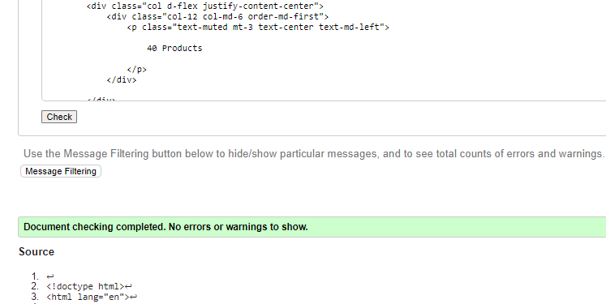

# TESTING

## Table of Contents

1. [Responsiveness](#responsiveness)
2. [Manual Testing](#manual-testing-of-user-stories)
3. [Validators](#validators)
    - [CI Python Linter](#ci-python-linter)
    - [JSHint](#jshint)
    - [W3C CSS Validator](#w3c-css-validator)
    - [W3C Markup Validator](#w3c-markup-validator)
    - [Lighthouse](#lighthouse)
    - [Lighthouse Errors](#lighthouse-errors)
    - [Wave Accessibility Tests](#wave-accessibility-tests)

## Note

***
## **Responsiveness**

All pages were tested to ensure responsiveness from devices of 320px and upwards.

| **Browser Tested**    | **Actual Result** | **Pass/Fail** |
|-----------------------|-------------------|---------------|
|    Microsoft Edge     |  As expected      |     Pass      | 
|     Google Chrome     |  As expected      |     Pass      |
|     Mozilla firefox   |  As expected      |     Pass      |
|      Safari           |  As expected      |     Pass      |

| **Device Tested**   | **Actual Result** | **Pass/Fail** |
|---------------------|-------------------|---------------|
|     S20 Ultra       |     As expected   |    Pass       |
|     iPhone 12 Pro   |     As expected   |    Pass       |
|Lenovo Thinkpad W541 |     As expected   |    Pass       |               
|Dell inspiron 3593   |     As expected   |    Pass       |  

## **Manual testing of user stories**

### User story:Home Page
* As an unregistered user i would like to be able to view the website homepage so that i can have an overview of the site.

**Step** | **Expected Result** | **Actual Result**
------------ | ------------ | ------------ |
User can navigate to [Home Page](https://dental-decor-ee0d87f16edf.herokuapp.com/) | Dental Decor home page loads | As Expected 
User can access all home page features. ie: carousal, shop now button, newsletter sub, Contact me form, social media links | All buttons, links, features work | As expected 
User should experince the home page to be responsive | App works on different device sizes | As expected

***

### User story:Navigation
* As a unregistered customer i want to navigate website easily so that i can find what i am looking for without difficulty

**Step** | **Expected Result** | **Actual Result**
------------ | ------------ | ------------ |
User can navigate through website  | Navigation is intuitive | As expected
User Can click on navbar links in different screen sizes | Navbar is responsive | As expected 
User Can hover over navlinks | Navbar icons change color | As expected 

***

### User story:Authentication and Authorization
* As a User i can register for website so that i can login so that my data is already saved from registering

**Step** | **Expected Result** | **Actual Result**
------------ | ------------ | ------------ |
User can click on login button  | User can only login once registered | As expected
User can click on register button | User can register if they have not before | As expected
User can click on forgot password link  | User can change password | As expected
User can clicks on register button but have already registered | User is informed that the email has already been registered | As expected

***

### User story:Footer
* As a User i can access the footer of the website so that i can visit the site's social media pages

**Step** | **Expected Result** | **Actual Result**
------------ | ------------ | ------------ |
User can scroll down to footer | footer is available on all pages | As expected
User can click on links on footer | Links can redirect user to relevant pages | As expected 

***

### User story:Products to shop
* As an unregistered customer i can see all the products available on the website so that i can decide if the website has a product i want to purchase

**Step** | **Expected Result** | **Actual Result**
------------ | ------------ | ------------ |
User can click on shop button/icon on navigation bar | Navigation link leads to shop products page | As expected 
User can click on shop now button on carousal in home page | Button redirects to shop products page | As expected 

*** 

### User story:Product details
* As an unregistered customer i can see details of each product in shop so that i can make more of an informed decision to see whether i want to purchase a particular product

**Step** | **Expected Result** | **Actual Result**
------------ | ------------ | ------------ |
User can click on "see more" button on each product card | User is directed to product details page | As expected 
User can scroll down product details page to view product information | User can see the sizes available and what the product is made of in details page| As expected 

***

### User story: Sorting and filtering Products
* As a customer i can sort or filter products so that i only see the products i want to see

**Step** | **Expected Result** | **Actual Result**
------------ | ------------ | ------------ |
User can click on dropdowns in products page |Product page Dropdowns allow users to categrorize or sort products | As expected 
User can see the amount of products for each category | Amount of products can be seen on top right corner of product page | As expected

***

### User story:Select & Add Products
* As a unauthenticated user/customer i can have functionality to select the product and add it to my shopping baske so that i can make more of an informed decision to see whether i want to purchase a particular product

**Step** | **Expected Result** | **Actual Result**
------------ | ------------ | ------------ |
User can click on add to bag button from product details page | The product added can now be seen in shopping bag, and navbar total will change accordingly next to  cart | As expected
User can click on add to bag button from wishlist page | The product added can be seen in shopping bag page and in success toast| As expected 

***

### User story:Adding multiple Products
* As a unauthenticated user/customer i can select multiple products and add them to my shopping basket so that add all desired products to the cart at once to save time

**Step** | **Expected Result** | **Actual Result**
------------ | ------------ | ------------ |
User can click on add to bag buttons for multiple products from product details page | The products that are added can be seen in shopping bag page | As expected 
User can click on add to bag buttons for multiple products from wishlist page | The products can be seen in shopping bag page | As expected

***

### User story:Product quantity feature
* As a *unauthenticated user/customer i can increase or decrease the quantity of products in my shopping basket so that so I have the freedom to change my mind if i want to

**Step** | **Expected Result** | **Actual Result**
------------ | ------------ | ------------ |
User can click in increment button in product details page | increase the amount of product that you want to add to shopping bag | as expected 
User can click in decrement button in product details page | decrease the amount of product that you want to add to shopping bag | as expected
User can click in increment button in wishlist page | increase the amount of product that you want to add to shopping bag | as expected
User can click in decrement button in wishlist page | decrease the amount of product that you want to add to shopping bag | as expected
User can click in increment button in shoppingbag page | increase the amount of product that you want to add to shopping bag if user presses updated button | as expected
User can click in decrement button in shoppingbag page | decrease the amount of product that you want to add to shopping bag if user clicks on updated button | as expected

***

### User story:Direct to Checkout
* As a unregistered user i can checkout so that i can purchase items without signing up

**Step** | **Expected Result** | **Actual Result**
------------ | ------------ | ------------ |
User can click on proceed to checkout button | User is redirected to checkout page if shopping bag has products | As expected

***

### User story:Save details
* As a registered user i can save my details so that future purchases will be less time consuming

**Step** | **Expected Result** | **Actual Result**
------------ | ------------ | ------------ |
User can click on save details button | Details should be saved in User profile | As expected 
User does not click on save details button | Details are not saved in User profile | As expected 

***

### User story:Create an Account
* As an unauthenticated user/customer i can sign up so that i can register for an account

**Step** | **Expected Result** | **Actual Result**
------------ | ------------ | ------------ |
User can naviagte to account navlink dropdown with register link | Directed to Singup page | As expected 
User can click signup button after entering details | User is sent verification link via email | As expected 
User can click link to confirm verification | User is shown success message for signing up | As expected 

***

### User story:Card details
* As a user i can put in my card details so that i can buy items with credit/debit cards

**Step** | **Expected Result** | **Actual Result**
------------ | ------------ | ------------ |
User can navigate to checkout page form  on shopping bag page , or from secure checkout page from toast | checkout page loads| As expected 
User can enter valid card details in checkout form | Validation error if incorrect card details are given | As expected 

***

### User story:Checkout Form
* As a authenticated user/customer i can add my details to a secure checkout form so that i can see all the purchases i have made

**Step** | **Expected Result** | **Actual Result**
------------ | ------------ | ------------ |
User can navigate to profile navigation tab | Orders purchased can be viewed in profile page | As expected 
User can click on each individual order that was made | User is shown details for each order that was made in the past | As expected

### User story:Payment with Card
* As a customer i can put in my card details so that i can make a purchase

**Step** | **Expected Result** | **Actual Result**
------------ | ------------ | ------------ |
User can click on complete order button on checkout page but did not put in card details|  form will request user to enter card details | As expected 
User can click on complete order button on checkout page and has put in a valid card details | Loading page appears until user is directed to checkout sucess page | As expected 

***

### User story:Add reviews
* As a Registered User i can add reviews so that i can give feedback to the owners of the products

**Step** | **Expected Result** | **Actual Result**
------------ | ------------ | ------------ |
User click on add review button in product details page | Add review modal pops up If user hasnt added a review for a product yet | As expected 
User click on add review button but they have already added review for particular product | Error toast pops up saying user has already reviewed product | As expected 

***

### User story:Edit Reviews

* As a Registered User i can edit reviews so that i can give change my reviews incase i made a mistake

**Step** | **Expected Result** | **Actual Result**
------------ | ------------ | ------------ |
User can click on edit review button for their reviews | Edit review modal pops up for user to edit their existing review | As expected
User can scroll down to see other users reviews | Edit review button is not shown for reviews that are not the users| As expected

***

### User story:Delete reviews
* As a Registered User i can Delete reviews so that i can remove a review if i changed my mind

**Step** | **Expected Result** | **Actual Result**
------------ | ------------ | ------------ |
User can click on delete button for user's reviews | Delete review modal pops up to confirm user's actions | As expected 
User can click on delete button on delete review modal | Review made by user is then deleted | As expected

### User story:Add to wishlist
* As a User i can add to wishlist so that i can have a list of products that i want to buy in the future

**Step** | **Expected Result** | **Actual Result**
------------ | ------------ | ------------ |
User can click on heart button in shop products page | Product is added to wishlist page | As expected 
User can click on heart button in product details page | Product is added to wishlist page | As expected 
User can click on heart button in product details page or shop products page but user had already added these products to wishlist before | An error message is shown to user saying that the product has already been added | As expected 

### User story:Remove from wishlist
* As a User i can remove from wishlist so that i can change the list of products that i want to buy in the future

**Step** | **Expected Result** | **Actual Result**
------------ | ------------ | ------------ |
User can click on "X" button for products in wishlist | remove modal pops up for user to confirm removal of product from wishlist | As expected  
User can click on remove button in confirm removal popup | wishlist item is removed from wishlist page | As expected  

### User story:Contact Us
* As a User i can Send a Contact us Query so that i can have the necessary information i require regarding the products or the website information

**Step** | **Expected Result** | **Actual Result**
------------ | ------------ | ------------ |
User can click on phone icon on navbar | User is directed to contact us form | As expected 
User can click on send query button in contact us form | User is given a success message that the message has been sent and user is sent an email message| As expected

### User story:See Reviews 
* As a User i can see all product reviews so that i can decide if i want to buy a product with more information

**Step** | **Expected Result** | **Actual Result**
------------ | ------------ | ------------ |
User can scroll down on product details page | User is able to see all reviews for that particular product | As expected 

***

### User story:Email Confirmation 
* As a User i can have email confirmation so that i can make sure that the products i bought are really ordered or not

**Step** | **Expected Result** | **Actual Result**
------------ | ------------ | ------------ |
User clicks on complete order button in Checkout page | User is redirected to checkout success page and recieves an email confirming order | As expected

***

### User story: Add new products in shop
* As a site developer i can add new products to the shop so that there are more products in the store

**Step** | **Expected Result** | **Actual Result**
------------ | ------------ | ------------ |
User can click on product management link if user is superuser | User is redirected to add products page where user can add new products to shop | As expected

***

### User story:Delete Products
* As a site owner i can delete existing products from the shop so that users are not shown items that are no longer available

**Step** | **Expected Result** | **Actual Result**
------------ | ------------ | ------------ |
Site owner can click on delete product button in product details page | Delete product confirmation modal pops up | As expected 
Site owner can click on delete button on confirm product deletion modal | Product is deleted from shop | As expected 

***

### User story:Edit products
* As a Site dev i can edit product information so that the website and product information is updated and relevant

**Step** | **Expected Result** | **Actual Result**
------------ | ------------ | ------------ |
Super user can click on edit product button on product details page | User is directed to edit product page | As expected 
Super user can change information of existing product in edit product page and click on update product button| Success message is shown and the particular product's details have been updated | As expected 

***

### User story: Secure payment 
* As a site owner, I want to provide secure payment options for customers so that payment process is safe and secure and customers card details are remained private

**Step** | **Expected Result** | **Actual Result**
------------ | ------------ | ------------ |
User can enter valid card details and click on complete order button | Loading overlay appears that shows loading animation and payment information is accepted | As expected

***
## **Validators**

### **CI Python Linter**

The [CI Python Linter](https://pep8ci.herokuapp.com/) was used to validate the python code used throughout the project. The results are outlined in below:

|     **Files**      |     **Result**    |    **Pass**   |
|--------------------|-------------------|---------------|
|   **DentalDecor**  |                   |               |
| asgi.py            |returned no errors |     Pass      |
| settings.py        |returned no errors |     Pass      |
| urls.py            |returned no errors |     Pass      |
| wsgi.py            |returned no errors |     Pass      |
|--------------------|-------------------|---------------|
|     **HOME**       |                   |               |
| admin.py           |returned no errors |     Pass      |
| apps.py            |returned no errors |     Pass      |
| urls.py            |returned no errors |     Pass      |
| views.py           |returned no errors |     Pass      |
| test_views.py      |returned no errors |     Pass      |
|--------------------|-------------------|---------------|
|    **Products**    |                   |               |
| admin.py           |returned no errors |     Pass      |
| apps.py            |returned no errors |     Pass      |
| urls.py            |returned no errors |     Pass      |
| views.py           |returned no errors |     Pass      |
| models.py          |returned no errors |     Pass      |
|--------------------|-------------------|---------------|
|  **reviews**       |                   |               |
| admin.py           |returned no errors |     Pass      |
| apps.py            |returned no errors |     Pass      |
| urls.py            |returned no errors |     Pass      |
| views.py           |returned no errors |     Pass      |
| models.py          |returned no errors |     Pass      |
| forms.py           |returned no errors |     Pass      |
|--------------------|-------------------|---------------|
|    **Profile**     |                   |               |
| admin.py           |returned no errors |    Pass       |
| apps.py            |returned no errors |    Pass       |
| urls.py            |returned no errors |    Pass       |
| views.py           |returned no errors |    Pass       |
| models.py          |returned no errors |    Pass       |
| forms.py           |returned no errors |    Pass       |
|--------------------|-------------------|---------------|

### **JSHint**

**add_rate.js**

### **W3C CSS Validator**

base.css was passed through [W3C CSS Validator](https://jigsaw.w3.org/css-validator/) with no errors.

* 

* 

* 

* 

### **W3C Markup Validator**

All pages were run through the [W3C Markup Validator](https://validator.w3.org/nu/). Initially, there were some errors but all these issues were corrected and all pages passed validation.

The errors shown below were all corrected accordingly:

1. Error 1

**homepage**

**review page**

**login**

**logout**

**profile**

**signup**

**Shopping bag page**

**Checkout page**

**Wishlist page**

**Product detail page**

**Shop products page**

**Add product page**

**Edit product page**

**Checkout success Page**

### **Lighthouse**

A number of issues were found during lighthouse testing which were all corrected.
Namely :

#### **Home Page**

***Mobile***

***Desktop***

#### **Profile Page**

***Mobile***

***Desktop***

#### **Review/Rating Page**

***Mobile***

***Desktop***

#### **Shopping bag page**

***Mobile***

***Desktop***

#### **Checkout page**

***Mobile***

***Desktop***

#### **Wishlist page**

***Mobile***

***Desktop***

#### **Product detail page**

***Mobile***

***Desktop***

#### **Shop products page**

***Mobile***

***Desktop***

#### **Add product page**

***Mobile***

***Desktop***

#### **Edit product page**

***Mobile***

***Desktop***

#### **Checkout success Page**

***Mobile***

***Desktop***

#### **Signup**

***Mobile***

***Desktop***

#### **Login**

***Mobile***

***Desktop***

#### **logout**

***Mobile***

***Desktop***

### **Wave Accessibility Tests**

All pages were tested using [Wave Evaluation Tool](https://wave.webaim.org/) via the Chrome extension.
The following errors were found and corrected : 

**homepage**

**review page**

**login**

**logout**

**profile**

**signup**

**Shopping bag page**

**Checkout page**

**Wishlist page**

**Product detail page**

**Shop products page**

**Add product page**

**Edit product page**

**Checkout success Page**

***

Return to  [README]() document.